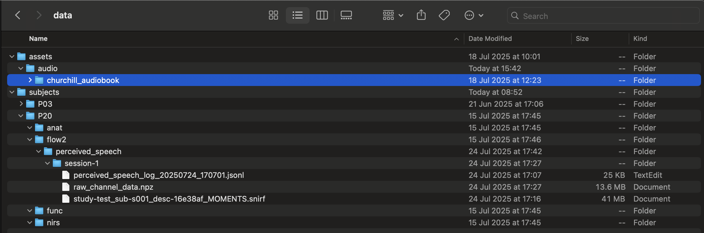
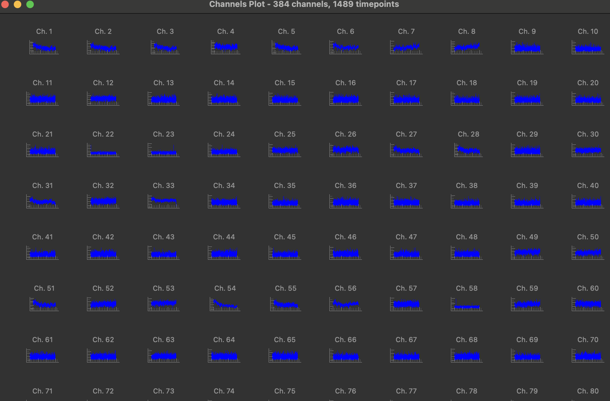
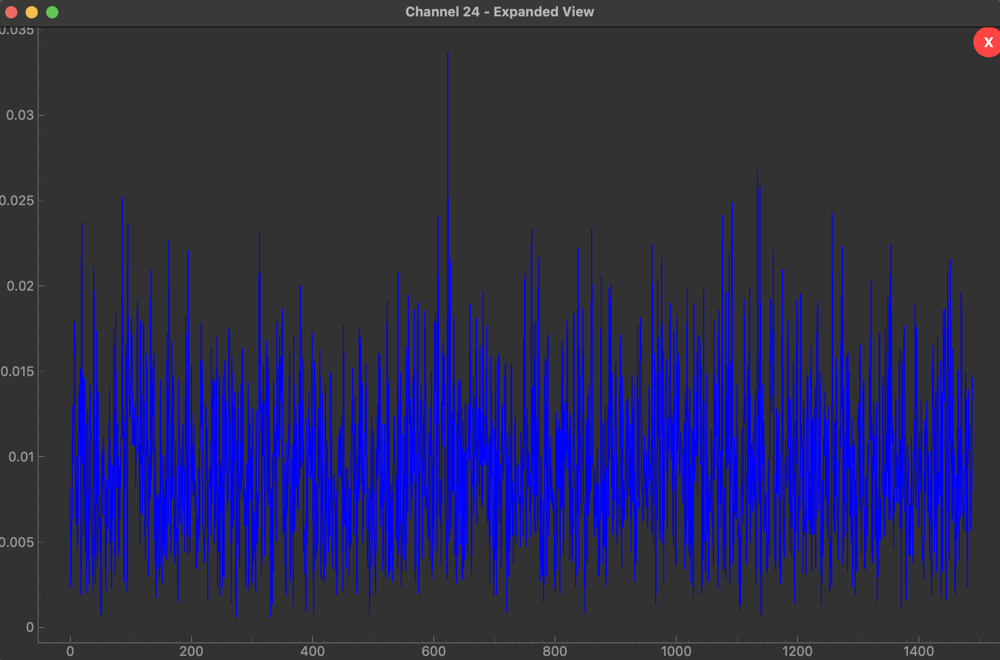
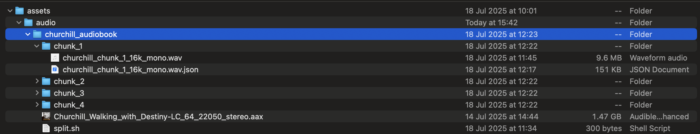

# Lys

## Table of Contents

- [Data Folder Structure](#data-folder-structure)
- [Data Directory Setup](#data-directory-setup)
- [Demo Usage](#demo-usage)
  - [Processing Demo](#processing-demo)
  - [ML Dataset Conversion Demo](#ml-dataset-conversion-demo)
- [Notes on Project Architecture](#notes-on-project-architecture)
- [Examples folder](#examples-folder)
- [Visualization](#visualization)
  - [3D plots](#3d-plots)
  - [Channel Data Plots](#channel-data-plots)
- [Preprocessing](#preprocessing)
- [Some of our objects](#some-of-our-objects)
  - [Patient Class](#patient-class)
  - [Jacobian](#jacobian)
  - [Eigenmodes](#eigenmodes)
- [Notes on recording perceived speech data](#notes-on-recording-perceived-speech-data)
  - [Flow2](#flow2)

TODO:
- (lots of #TODO tags throughout the code, grep for them and fix)

## Data Folder Structure

<p align="center">
  
</p>

## Data Directory Setup

Before using Lys, you must set the `LYS_DATA_DIR` environment variable in your shell configuration (e.g., `.bashrc`, `.zshrc`). This variable should point to the root directory where your data is stored. For example:

```bash
LYS_DATA_DIR="/Users/thomasrialan/Documents/code/Geometric-Eigenmodes/data"
export LYS_DATA_DIR
```

Make sure to restart your terminal or source your shell configuration after making this change:

```bash
source ~/.bashrc  # or source ~/.zshrc
```

This is cool because now we can call `lys.utils.paths.lys_data_dir()` and even if we have different computers it'll work for us all.
## Demo Usage

We have some demo scripts in `/scripts`, here we discuss them a bit.

### Processing Demo

Here's a simple example of how to use Lys to process an experiment. First we have to load it:

```python
from lys.objects.experiment import create_experiment
experiment_name = "fnirs_8classes"
experiment = create_experiment(experiment_name, "nirs")
experiment = experiment.filter_by_subjects(["P03"])
```

`create_experiment` takes 2 arguments: the experiment name, and the type of device. Currently we support two types of devices: "nirs" (which is Bettina's device) and "flow2" (our device).

An experiment is a list of sessions, `create_experiment` finds the folder in your file structure called "fnirs_8classes" and constructs an `Experiment` object. It can be filtered by subject. Once you've loaded an experiment, you may want to check that your meshes and volumes are aligned. Below we do that for the first session (different sessions may have different patients):

```python
from lys.visualization import VTKScene
mesh = experiment.sessions[0].patient.mesh
segmentation = experiment.sessions[0].patient.segmentation
scene = VTKScene(title="Mesh and segmentation alignment")
# See how our alignment is not perfect :( !! 
scene.add(mesh).add(segmentation).format(segmentation, opacity=0.02).show()
```

Notice the use of `.format()`, this is a general method for styling (see [Visualization](#visualization) for details) which we use here to reduce the opacity of the segmentation so that the mesh is visible underneath.

Then you may want to do some processing. In this codebase we distinguish pre-processing from processing in the following manner: pre-processing means turning raw files (e.g. `.snirf`) into numpy arrays (see e.g. the `raw_channel_data.npz` in [Data Folder Structure](#data-folder-structure)), and processing means stuff like bandpass filtering. We consider reconstruction a form of processing.

```python
config = [
    {"ConvertWavelengthsToOD": {}},
    {"ConvertODtoHbOandHbR": {}},
    {"RemoveScalpEffect": {}},
    {"ConvertToTStats": {}}, 
    {"ReconstructWithEigenmodes": {"num_eigenmodes": 200,
                                   "regularisation_param": 0.01}}
]

processing_pipeline = ProcessingPipeline(config)
experiment = processing_pipeline.apply(experiment)
```

What `processing_pipeline.apply()` does is for each session, it loops through each processing step in the order they're listed, and applies that step's `.process()` method to the session's `processed_data` attribute. Each `ProcessingStep` has keyword arguments, these are specified as above for `ReconstructWithEigenmodes`.

At the end of a `ProcessingPipeline`, the `MLDataPreparer` is called, this basically takes your processed data and stacks it all together into a np array that can be used as `X` in your `(X,y)` training examples / labels. This will print a warning telling you which parts of your data were included, and which were excluded, by default it only takes these keys: `allowed_keys = {"data", "wl1", "wl2", "HbO", "HbR"}` but you can specify custom allowed keys (or just extend the list of allowed keys and merge that).


- [ ] We may want to re-architect steps or processing so that stuff can happen "live", and then we'd fold pre-processing into processing and write the code such that non-live data is treated as live.

### ML Dataset Conversion Demo

Once you have processed an experiment, you can convert it into ML-ready datasets for training machine learning models. Here's how to split your experiment data into training, validation, and test sets:

```python
from lys.objects.experiment import create_experiment
from lys.ml.experiment_to_dataset_converter import ExperimentToDatasetConverter
from lys.ml.splitting_strategies import TemporalSplitter
from lys.processing.pipeline import ProcessingPipeline

experiment = create_experiment("perceived_speech", "flow2")

# Apply processing pipeline (even with no steps, this ensures MLDataPreparer runs)
pipeline = ProcessingPipeline([])
experiment = pipeline.apply(experiment)

splitter = TemporalSplitter()
converter = ExperimentToDatasetConverter(splitter)
datasets = converter.convert(experiment)

# Access the split datasets
print(f"Training set: {datasets.train.X.shape}")
print(f"Validation set: {datasets.val.X.shape}")  
print(f"Test set: {datasets.test.X.shape}")
```

You can use any data splitter that adheres to the DatasetSplitter ABC in `ml/splitting_strategies.py`.

## Notes on Project Architecture
- We keep abstract classes in `/abstract_interfaces`, this is good for readability / future users of the code to easily find concepts.
- We have many "domain objects", like a mesh, an optode, a session etc. These are kept in `/objects` for the same reason as above.
- We want to treat this as a library, like our internal numpy, and then use the tool for our work.
- Our work (outside building this library) should mostly happen inside `/research` and `steps.py`. 
  - [ ] TBD if this is the best way, goal is to separate library from messy R&D code.

## Examples folder

This is a good place to start learning how the code works. The `/examples` directory contains example scripts that demonstrate how to use the library. The scripts include:

- `processing_demo.py`: Demonstrates a complete experiment processing pipeline including wavelength conversion, hemoglobin reconstruction, scalp effect removal, t-statistics conversion, and eigenmode-based reconstruction with correlation analysis against MRI t-stats
- `viz_demo.py`: Shows 3D visualization capabilities with meshes and optodes


## Visualization
### 3D plots

The idea is to respect the Open-Closed principle + have composability. Whenever we define a new object that we want to be able to plot, it just needs to have a `to_vtk` method that returns a vtkActor and the `VTKScene` class can plot it. 

A few examples:

```python
from lys.objects.mesh import from_mat, StaticMeshData
from lys.visualization.plot3d import VTKScene

# Load a mesh from a MATLAB file, could also do load_unMNI_mesh("P03")
mesh = from_mat("/path/to/mesh.mat")

# Create and show the visualization
# A title can be provided to the scene on creation...
scene = VTKScene(title="My Awesome Scene")
scene.add(mesh)
# ...or when showing it.
scene.show(title="A New Title!")
scene.remove(mesh)

# If you want data on the mesh, e.g. t-stats
data = np.random.rand(mesh.vertices.shape[0])) * 3 #random numbers
static_data_mesh = StaticMeshData(mesh, data) 
scene.add(static_data_mesh) .show()
```

By default we use the full range of the colormap, so if you pass values between [0,0.3] then the cmap is normalised to use the full range of colors. If we so please, we could re-write this as a `normalize=True/False` argument but I think we always (?) want to use the full range of color.

```python
# Update the colormap to any allowed matplotlib colormap (or custom!)
scene.format(static_data_mesh, cmap="inferno")
```

**Working with Time-Series Data**

```python
scene = VTKScene(title="Time-Series Animation")
scene.add(time_series_mesh)
scene.show()
scene.format(time_series_mesh, opacity=0.5, cmap="viridis") #change the opacity and/or cmap
```

StaticDataMesh and TimeSeriesDataMesh styles can be changed with: new opacities, new colormaps.

**Style Options by Object Type**

| Type                | Style Updates (arguments to `apply_style`)                |
|---------------------|----------------------------------------------------------|
| **Atlas**           | `opacity`, `colors`                                       |
| **Points**          | `color`, `radius`, `opacity`                              |
| **Optodes**         | `radius`                                                  |
| **Volume**          | `opacity`, `color`, `data_range`, `cmap`                  |
| **Mesh**            | `opacity`                                                 |
| **StaticMeshData**  | `opacity`, `cmap`                                         |
| **TimeSeriesMeshData** | (delegates to StaticMeshData and Mesh, so: `opacity`, `cmap`) |

- For `Atlas`, you can update the opacity of all regions and provide a custom color mapping for regions.
- For `Points`, you can update the color (RGB tuple), radius, and opacity of the points.
- For `Optodes`, you can update the radius of the optode spheres (color is fixed: sources are red, detectors are blue).
- For `Volume`, you can update opacity, color, data range, and colormap.
- For `Mesh`, you can update opacity.
- For `StaticMeshData`, you can update opacity and colormap.
- For `TimeSeriesMeshData`, you can update opacity and colormap (applies to the current timepoint's data).


### Channel Data Plots 

See `examples/channelplot_demo.py` for an example you can run.

```python
from lys.visualization import ChannelsPlot
data = experiment.sessions[0].raw_data["wl1"]
plot = ChannelsPlot()
plot.plot(data.T) # expects shape: num channels x num timepoints
```


<p align="center">
  
  
</p>

**Snapshot Testing for Visualization**

To ensure that visualization outputs remain consistent over time, Lys uses **snapshot tests**. These tests render objects (such as meshes, atlases, and optodes), save a reference image (snapshot) on the first run, and compare future renders pixel-by-pixel against this snapshot. If a rendering changes unexpectedly, the test will fail, helping to catch regressions or unintended changes in visualization. You can find these tests in `tests/test_plot3d_snapshot.py` and the reference images in `tests/snapshots/`.

## Preprocessing

The preprocessing module is responsible for converting raw data files from various device-specific formats into standardized `.npz` files that can be efficiently loaded for further processing. This is distinct from processing, which handles operations like bandpass filtering and other signal processing tasks.

The system uses the **Strategy pattern** to automatically select the appropriate adapter based on the session content, making it easy to add support for new devices by implementing new adapters.

**How to Use Preprocessing:**

```python
from lys.processing.preprocessing import preprocess_experiment, RawSessionPreProcessor
from pathlib import Path

# Process a whole experiment (recommended):
preprocess_experiment("perceived_speech", "flow2")

# Process a single session (for more control):
session_path = Path("/path/to/session/directory")
RawSessionPreProcessor.preprocess(session_path)
```


**How It Works:**

1. **Automatic Adapter Selection**: The `RawSessionPreProcessor` automatically detects the appropriate adapter by examining the files in the session directory
2. **Device-Specific Processing**: Each adapter (like `BettinaSessionPreprocessor`) handles the specific file formats and data extraction for that device
3. **Standardized Output**: All adapters produce `.npz` files with consistent naming (`raw_channel_data.npz`) for easy loading

If you just want to check what a preprocessor does you could also do this:

```
    import os
    from lys.utils.paths import lys_subjects_dir
    
    session_path = Path(os.path.join(lys_subjects_dir(), "P20/flow2/perceived_speech/session-1"))
    processor = Flow2MomentsSessionPreprocessor()
    data = processor.extract_data(session_path)
```

**Current Supported Devices:**

- **Bettina Device**: Processes `.wl1` and `.wl2` files, extracting wavelength-specific data
- **Flow2Moments**: processes `.snirf` files from the `MOMENTS` pipeline (not yet the `HB_MOMENTS` or others, but easy to extend when we want this.)

**Extending for New Devices:**

This design ensures that the core processing logic remains decoupled from the specifics of any given data acquisition system.

To add support for a new device, implement a new adapter class that inherits from `ISessionPreprocessor`:

```python
class NewDeviceAdapter(ISessionPreprocessor):
    def can_handle(self, session_path: Path) -> bool:
        # Check for device-specific files or extensions
        files = [f.name for f in session_path.iterdir() if f.is_file()]
        return any(file.endswith(".device_specific_extension") for file in files)
    
    def extract_data(self, session_path: Path) -> dict:
        # Extract and return data as dictionary
        # Keys will become npz file keys
        return {'channel_data': data_array, 'metadata': metadata}
```

This modular approach makes it easy to extend the library's capabilities to new hardware without modifying the existing codebase.

## Some of our objects
### Patient Class

The `Patient` class represents a subject: it has a name, a segmentation and a mesh. It is a frozen dataclass, i.e. immutable, which avoids potential errors down the line.

**How to Instantiate a Patient**

To create a `Patient` object, use the `from_name` class method, which automatically loads the relevant segmentation and mesh data for the given patient identifier:

```python
from lys.objects import Patient

# Instantiate a patient by their identifier (e.g., "P03")
patient = Patient.from_name("P03")

# Access patient attributes
print(patient.name)           # 'P03'
print(patient.segmentation)   # Atlas object
print(patient.mesh)           # Mesh object
```

- `name`: The patient identifier string (e.g., "P03").
- `segmentation`: An `Atlas` object representing the patient's brain segmentation.
- `mesh`: A `Mesh` object representing the patient's brain surface mesh in native space.

**Why Immutability?**

The `Patient` class is defined as a frozen dataclass (`@dataclass(frozen=True)`), which means its attributes cannot be modified after creation. This design choice:
- Prevents accidental changes to patient data after loading.
- Makes `Patient` objects hashable and safe to use as dictionary keys or in sets.
- Encourages a functional programming style, improving code reliability and maintainability.

### Jacobian

The Jacobian module provides efficient loading and sampling of Jacobian matrices with **lazy loading** capabilities. This design ensures that large Jacobian files are only loaded into memory when actually needed, and shared files are cached to avoid redundant loading across sessions.

**Key Features:**

- **Lazy Loading**: Jacobian data is stored as HDF5 datasets that are only loaded into memory when accessed, significantly reducing memory usage for large files.
- **Caching**: The `JacobianFactory` ensures that identical Jacobian files (even via symbolic links) are loaded only once and cached for reuse.
- **Multi-wavelength Support**: Automatically detects and handles different wavelengths (wl1, wl2) from file paths.
- **Vertex Sampling**: Provides efficient sampling at arbitrary 3D coordinates using nearest-neighbor interpolation (aka discretizes).

**Example Usage:**

```python
from lys.objects.jacobian import load_jacobians_from_session_dir
from pathlib import Path

# Load all Jacobians from a session directory
session_dir = Path("/path/to/session/directory")
jacobians = load_jacobians_from_session_dir(session_dir)

# Access individual Jacobians by wavelength
wl1_jacobian = next(j for j in jacobians if j.wavelength == 'wl1')
wl2_jacobian = next(j for j in jacobians if j.wavelength == 'wl2')

# Sample values at specific 3D coordinates
vertices = np.array([[10, 20, 30], [40, 50, 60]])
sampled_values = wl1_jacobian.sample_at_vertices(vertices)
print(sampled_values.shape)  # (S, D, N) where S=sources, D=detectors, N=vertices

# Get a slice of the data (loads into memory)
data_slice = wl1_jacobian.get_slice((0, :, :, :, :))
```

**Lazy Loading Architecture:**

The Jacobian system uses a factory pattern with lazy loading to optimize memory usage and performance:

1. **JacobianFactory**: A singleton factory that manages caching of Jacobian objects. It uses canonical file paths as cache keys, so symbolic links pointing to the same file are handled correctly.

2. **Lazy Data Access**: The `Jacobian` class stores an `h5py.Dataset` reference rather than loading the entire array into memory. Data is only loaded when explicitly accessed through methods like `sample_at_vertices()` or `get_slice()`.

3. **Automatic Caching**: When `load_jacobians_from_session_dir()` is called multiple times with the same session directory, the factory returns cached objects instead of reloading files.

**Benefits of Lazy Loading:**

- **Memory Efficiency**: Large Jacobian files (often several GB) are not loaded into memory until needed
- **Shared File Optimization**: When multiple sessions reference the same Jacobian file (via symlinks), it's loaded only once
- **Flexible Access**: Supports both point sampling and bulk data access patterns
- **Scalability**: Can handle many Jacobian files without memory issues

**File Format Support:**

Currently supports MATLAB `.mat` files containing HDF5 datasets. The system is designed to be extensible for additional file formats in the future.

**Notes:**

- Coordinates for `sample_at_vertices()` should be in the index space of the Jacobian data (0 to shape-1 for each axis)
- The method automatically discretizes coordinates to nearest integer indices using `np.rint()`
- The system automatically extracts wavelength information from filenames (looks for 'wl1' or 'wl2' in the path)
- No data transposition is performed during loading; orientation corrections should be handled when accessing the data

### Eigenmodes

The eigenmodes module provides functionality for loading and working with brain eigenmodes from MATLAB files. Eigenmodes are mathematical representations of brain connectivity patterns that can be used for signal reconstruction and analysis.

**How to Load Eigenmodes:**

```python
from lys.objects.eigenmodes import load_eigenmodes

# Load eigenmodes for a specific patient
patient_name = "P03"
eigenmodes = load_eigenmodes(patient_name)

# Access individual eigenmodes
first_eigenmode = eigenmodes[0]
print(f"Eigenvalue: {first_eigenmode.eigenvalue}")
print(f"Eigenmode values shape: {first_eigenmode.shape}")  # (N_vertices,)
```

**File Location and Naming Convention:**

Eigenmode files are expected to be located in the patient's anatomy directory with a specific naming pattern:

```
{patient}/anat/meshes/{patient}_EIGMOD_MPR_IIHC_MNI_WM_LH_edited_again_RECOSM_unMNI_D32k_eigenmodes.mat
```

For example, for patient "P03", the file would be:
```
P03/anat/meshes/P03_EIGMOD_MPR_IIHC_MNI_WM_LH_edited_again_RECOSM_unMNI_D32k_eigenmodes.mat
```

**Data Structure:**

The MATLAB file should contain:
- `eigenmodes`: A 2D array where each column represents one eigenmode (shape: N_vertices × N_eigenmodes)
- `eigenvalues`: A 1D array containing the corresponding eigenvalues (shape: N_eigenmodes)

**Eigenmode Objects:**

Each eigenmode is represented as an `Eigenmode` object, which is a subclass of `np.ndarray` with an additional `eigenvalue` attribute. This allows you to work with eigenmode values as regular numpy arrays while maintaining access to the associated eigenvalue.


## Notes on recording perceived speech data

We use [audible-cli](https://github.com/mkb79/audible-cli) to download audiobooks, and whisper to transcribe them with word-level timestamps. Claude estimates this to have ~20ms accuracy which is good enough for NIRS/EEG.

Example download and conversion to `.mp3` of a book:

```
audible library list
audible download --asin 0141987162 --output-dir ./audiobooks/ --aax
audible activation-bytes #this gives some number, here "7935c812"
ffmpeg -activation_bytes 7935c812 -i "./audiobooks/Churchill_Walking_with_Destiny-LC_64_22050_stereo.aax" -c:a libmp3lame "./audiobooks/churchill.mp3" #converts .aax file to .mp3
```

Then this book needs to be transcribed so that each word is timestamped. We do this with [whisper.cpp](https://github.com/ggml-org/whisper.cpp) for performance.

To generate a transcript, clone and make the `whisper.cpp` repo, download a model (`large-v3-turbo` is good, smaller models seem quite bad) like this:

```bash
bash ./models/download-ggml-model.sh large-v3-turbo
```

 and run this command: 

```bash
MODEL_PATH="/Users/thomasrialan/Documents/code/whisper.cpp/models/ggml-large-v3-turbo.bin"
WHISPER_BIN="/Users/thomasrialan/Documents/code/whisper.cpp/build/bin/whisper-cli"
"$WHISPER_BIN" -m "$MODEL_PATH" -f <file path here!> -oj -ml 1
```

`-ml 1` is max-length argument, meaning we want timestamps for each word, `-oj` means we want `.json` output.

To convert `.mp3` to 16k mono `.wav`:

```bash
ffmpeg -i file.mp3 -ar 16000 -ac 1 file_16k_mono.wav
```

(I'm not certain this is necessary). Then we might want to split the audio into chunks of 15 minutes, which make for short (and hence more focused?) recordings.

### Flow2
Currently we have to manually start and stop the Flow2 recording, however pre-processing takes care of aligning timestamps. Our `TaskExecutor` uses the [Kernel Tasks SDK](https://docs.kernel.com/docs/kernel-tasks-sdk) to send an event to the `.snirf` when we press "play" on the GUI. 

You can run `examples/task_demo.py`, for this to work you need at least some audio files. These must be stored alongside their timestamped transcripts, see screenshot below. See the section above for how to generate these with whisper.cpp.


<p align="center">
  
</p>


Current steps:
1. Do the steps on the Kernel portal to get the recording started (tune the lasers, etc...),
2. Run `data_recording/perceived_speech.py`, pick a recording and press play
3. Either wait for the audio recording to end, or press stop,
4. Stop the recording on the Kernel portal,
5. Wait a few mins for uploading to Kernel Cloud [this steps needs to be removed w/offline mode]
6. Run the Moments pipeline
7. Put the resulting .snirf file in the session folder (also done manually, sigh)
8. Run pre-processing

